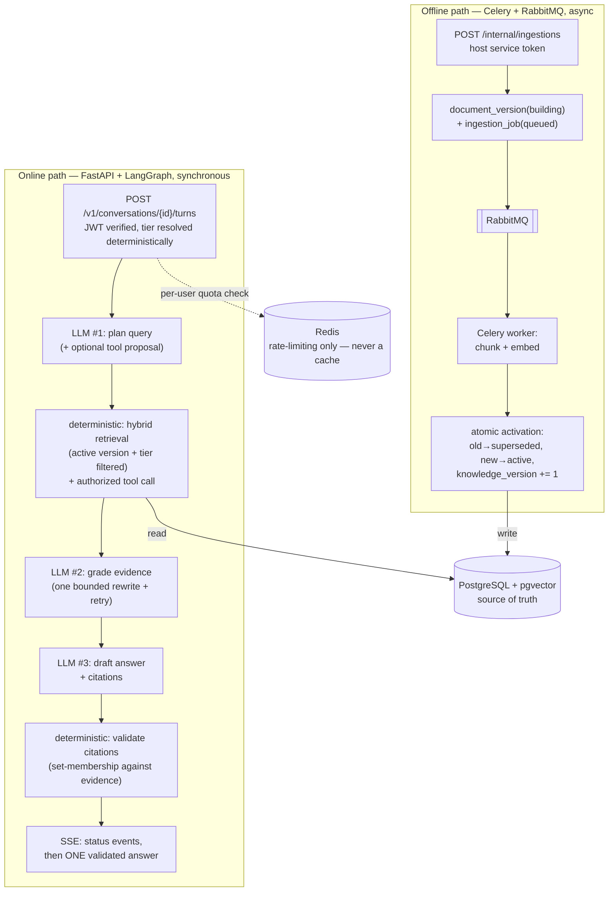

# RAG Chatbot Service

A single-tenant RAG chatbot embedded into a Payment & Subscription Platform (Spring Boot host).
Two independent execution paths meet only at PostgreSQL + pgvector: an **online path**
(FastAPI + LangGraph, synchronous, a user is waiting) that plans a query, retrieves evidence,
grades it, drafts an answer, and deterministically validates its citations before streaming
anything back — and an **offline path** (Celery + RabbitMQ) that turns a submitted document into a
versioned, embedded, atomically-activated knowledge base in the background.

Core stance: **the LLM proposes, the application decides.** The LLM plans queries, proposes tool
calls, grades evidence, and drafts answers — every one of those outputs is deterministically
validated or gated before it has any effect. It never decides authorization, never executes a tool
or SQL directly, and its citations are never trusted without a deterministic set-membership check.

The full architecture, data model, guardrails, and the release-blocking invariants this codebase
holds to are in [`CLAUDE.md`](CLAUDE.md) and
[`rag_chatbot_plan_development_plan_v3.5.md`](rag_chatbot_plan_development_plan_v3.5.md) (the
detailed plan)

## Architecture



Online and offline are independent in *how* they execute — the online path never touches
Celery/RabbitMQ, and the offline path never runs LangGraph — and meet only at Postgres. See Plan
§2 for the full walkthrough (a plain-language version and a technical trace of each path) and
Plan §8/§12 for the LangGraph graph and the Celery/RabbitMQ pipeline in detail.

## Why these technology choices

Short version — each links to the ADR with the full reasoning, so it isn't duplicated here:

- **LangGraph**, only for the online path: a bounded state machine (routing, evidence grading, one
  rewrite, a validation gate) is what the online path actually needs — not an autonomous
  multi-agent framework. Plan §0, §8.
- **Celery + RabbitMQ**, not a simpler PostgreSQL-based queue (`FOR UPDATE SKIP LOCKED`): a
  deliberate choice, argued against that simpler alternative explicitly. Plan §12.1 (ADR).
- **Redis is rate-limiting only in MVP, never a cache**: adding a cache "while you're in there" is
  explicitly against this project's rule — caching gets added only after a measured bottleneck
  justifies it, not preemptively. Plan §13.2.
- **No Kafka**: no multi-producer/multi-consumer fan-out, event replay, or throughput need that
  would justify it yet. Plan §0.
- **No LangChain Core**: `ChatModelClient`/`EmbeddingClient` are small typed protocols directly
  over provider SDKs; LangGraph pulls `langchain-core` in transitively (unavoidable), but this
  project's own code never imports it (enforced by
  `tests/unit/test_dependency_guards.py`). Plan §0, §21.

## How to run

```bash
cp .env.example .env        # fill in passwords/secrets; .env is gitignored
docker compose up -d --build --wait   # api, celery-worker, postgres, redis, rabbitmq
```

Migrations run automatically on `api` container startup (`alembic upgrade head` — see
`docker-compose.yml`'s `api` service `command:`); there is no separate manual migration step for
the compose stack.

```bash
# Ingest a document (fake embedder by default — no API key needed; add --embeddings gemini for real ones)
python -m app.ingestion.cli ingest ./documents [--embeddings gemini]

# Ask a question through the real LangGraph workflow
python -m app.ai.cli ask "What is the refund window?" --tier general [--fake]
```

See [`DEMO.md`](DEMO.md) for the full "update a policy → track the ingestion job → chatbot uses
the new version → citation opens the correct source" walkthrough.

### Eval runner (Plan §16.4)

```bash
# One-time: a dedicated, persistent database (never the dev DB, never a throwaway test DB)
createdb chatbot_eval
DATABASE_URL=postgresql+psycopg://chatbot:<password>@127.0.0.1:5434/chatbot_eval alembic upgrade head
DATABASE_URL=...chatbot_eval alembic upgrade head  # (same URL) then:
DATABASE_URL=...chatbot_eval python -m app.ingestion.cli ingest app/eval/golden/corpus --embeddings gemini

# Run the 22 golden questions (app/eval/golden/questions.json) through the real graph
DATABASE_URL=...chatbot_eval python -m app.eval.cli run \
    --questions app/eval/golden/questions.json --out ./eval_reports/$(date +%F)
```

`--fake` also works (no API key, no `chatbot_eval` setup needed against a throwaway DB) but its
correctness/retrieval numbers are meaningless — `build_fake_registry()`'s deterministic responder
cannot judge topical relevance, only exercise the plumbing end to end. The report's
`answer_correctness`/`groundedness` columns are always left blank: this runner never grades them
(no LLM-judge — a human fills those in; see `app/eval/runner.py`'s module docstring).

## How to test

```bash
pytest -q                      # full suite; integration tests need DATABASE_URL (compose postgres: 127.0.0.1:5434)
pytest -q tests/unit           # no broker/DB needed
GEMINI_API_KEY=... pytest -q -m live tests/live   # real API; skipped without a key; sparing on free tier
```

`ruff check .` / `mypy` for lint/typecheck. See `CLAUDE.md`'s Commands section for the complete,
kept-accurate list (this README's snippets above are copied from it, not a separate source).

## Where to look next

- [`CLAUDE.md`](CLAUDE.md) — the golden invariants (release-blocking, never violate), module map,
  and working agreement for changes to this codebase.
- [`rag_chatbot_plan_development_plan_v3.5.md`](rag_chatbot_plan_development_plan_v3.5.md) — the
  full plan: data model (§5), the LangGraph graph (§8), retrieval SQL (§9), LLM integration and
  guardrails (§11), the ingestion/Celery ADR (§12), testing strategy (§16), the 8-week roadmap
  (§18), and Definition of Done (§19).
- [`DEMO.md`](DEMO.md) — a reproducible, step-by-step demo script.
